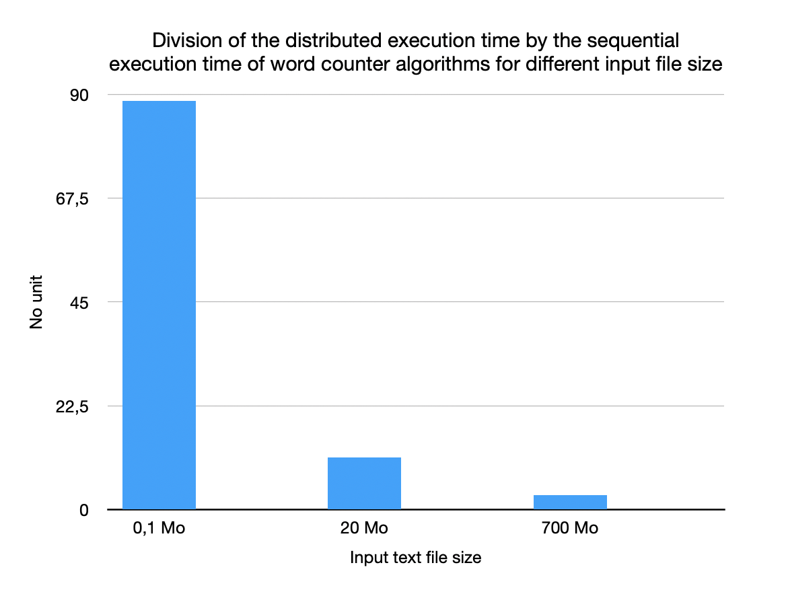

# Hadoop MapReduce *from scratch*

## Table of Contents
- [Hadoop MapReduce *from scratch*](#hadoop-mapreduce-from-scratch)
  - [Table of Contents](#table-of-contents)
  - [Introduction](#introduction)
  - [Quick Setup](#quick-setup)
  - [Problems encountered and Resolution](#problems-encountered-and-resolution)
    - [Computing Distribution](#computing-distribution)
    - [Various Optimizations](#various-optimizations)
      - [Splitting](#splitting)
      - [Listing](#listing)
    - [SCP Limits](#scp-limits)
  - [Results](#results)

----

## Introduction
This project aims to create a simple implementation of the MapReduce concept in Java.
This will allow to visualize and empirically demonstrate Ahmdal's law.
I will use a word count process for this implementation, and I will compare the results between this distributed implementation and a sequential one.

This project is based upon a [practical work](https://remisharrock.fr/courses/simple-hadoop-mapreduce-from-scratch/) in Télécom Paris (SLR207 course), taught by Rémi Sharrock.


---

## Quick Setup
> All following commands will assume that you are in the `Hadoop` folder, which is the root of this project.

This project is divided into five folders:  `Clean`, `Deploy`, `Master`, `Worker` and `Resources`.
To launch the project, you first need to add the names of the distant machines you want to accesse in a `machines.txt` file inside the `Resources` folder.

Then, you have to add your input files in the folder `Resources>inputs`. These are text files where you want to count their number of words.

You can then run the cleaning phase, which will create a folder in `\tmp` in each distant machine. If this folder already exists (because of a previous execution), it will delete it.
```zsh
cd Clean; java -jar Clean.jar; cd ..
```

Then, you need to send to worker program to all your distant machines. This is achieved during the deploy phase.
```zsh
cd Deploy; java -jar Deploy.jar; cd ..
```

Now, all your distant computers are correcty configured. From now on, you can launch the Master program on as much input files as you want. For an input file named `input.txt`, you can run the command :
```zsh
cd Master; java -jar Master.jar input.txt; cd ..
```
This will create the folder `Resources>outputs`in which you will find all outputs of Master execution, in a text file named `input-REDUCED.txt`. A Master execution will also create a folder `Resources>splits`which will contain splits of the text file `input.txt`, however this folder will be replaced by new splits at each execution of Master.

---

## Problems encountered and Resolution

### Computing Distribution
parler du séquentiel, puis des threads, puis de la liste

The goal of this program is to be quicker than a sequential version, at least for large files. This means that we have to compute a maximum of tasks in parallel on all distant computers. According to Amdhal's law, the speedup will increase with the proportion of parallelized tasks and with the number of processors.

On my first attempt to implement the MapReduce algorithm, I just launched a `ProcessBuilder` (to execute a command on a distant machine) and waited for its completion, before launching the next `ProcessBuilder`. 
```java
for(hostname : computerList){
      ProcessBuilder pb1 = new ProcessBuilder("ssh", username+"@"+hostname, "mkdir " + distantPath);
  Process p1 = pb1.start();
  boolean timeoutStatus1 = p1.waitFor(secondsTimeout, TimeUnit.SECONDS);
}
```
But by waiting for each task to finish, the execution of this program is necessarily slower (or equal) to the time of execution of a sequential version. So I searched for a parallelized version of this code. My first attempt was to use `Threads` and `CountDownLatch`, to allow the Master to simultaneously wait for several distant machines.
```java
mkdirCountdown = new CountDownLatch(numberOfDistantComputers);

for(hostname : computerList){
  new Thread() {
    public void run() {
      ProcessBuilder pb1 = new ProcessBuilder("ssh", username+"@"+hostname, "mkdir " + distantPath);
      Process p1 = pb1.start();
      boolean timeoutStatus1 = p1.waitFor(secondsTimeout, TimeUnit.SECONDS);
      mkdirCountdown.countDown()
    }
  }.start();
}

//waiting for all threads to finish waiting for the distant computer
boolean globalTimeoutStatus = mkdirCountdown.await(secondsTimeout, TimeUnit.SECONDS);
```
But this was a very complex solution to a very simple problem. A more efficient idea was to use two `for` loops, one to launch all `ProcessBuilder`, and a second one to wait for them.

```java
mapOfProcesses = new HashMap<String,Process>();

//...

for (String hostname : mapOfProcesses.keySet()){
  ProcessBuilder pb1 = new ProcessBuilder("ssh", username+"@"+hostname, "mkdir " + distantPath);
  Process p1 = pb1.start();
  mapOfProcesses.replace(hostname, p1);
}

for(String hostname : mapOfProcesses.keySet()){
  Process p = mapOfProcesses.get(hostname);
  boolean timeoutStatus1 = p.waitFor(secondsTimeout, TimeUnit.SECONDS);
}
```
Ultimately, I used this last method to parallelize as most code as possible. I parallelized cleaning, deployment of files, directory creation, shuffling, reducing. A long process that I have not parallelized is the gathering of all distant reduce files. This phase aims at reading the reduce file of each distant machine and writing its content on the local `input-REDUCED.txt` text file. To avoid conflicts with multiple writers, I kept this phase sequential.

Another long process that I initially parallelized was the split deployment, that consists in sending a big file of text to each distant machine using SCP. I ultimately removed the parallelization, due to the fact that the speed of this phase depends only on the network bandwith. Parallelization does not speed this phase up when working with big files, because the bandwith is shared between the several uploads, which results into a similar (or slightly slower) speed compared to the sequential way (one upload after the other). However, it does speed up a little bit when working with light files that can be quickly simultaneously send.

### Various Optimizations
As this implementation is meant to be used on huge text files (in the hope of seeing better performance than the sequential version), I added several optimizations to make the program execution - a lot - faster than my original implementation.

The two biggest optimizations I had to made concern splitting and listing, and transformed my program to "unusable" to "really fast".

#### Splitting
Splitting the `input.txt` is essential for the MapReduce algorithm.

My original idea to split this file was to create as much empty split files as the number of distant computers. Then, I would read each word `input.txt`, and copy it to a split file chosen in a round-robin way (with the modulo operator: `wordNumber%numberOfDistantComputers`).
This method works well for relatively small files (up to some megabytes), but it is terribly slow for big files (some hunndreds of megabytes).

A way more efficient method is to use the Linux `split` command (or `gsplit` on macOS). This allow to split a huge file in the desired number of splits, in a fraction of seconds.
```java
ProcessBuilder pb = new ProcessBuilder("gsplit","-n",""+numberOfDistantComputers,"-d","--additional-suffix",".txt",inputFileName,"../splits/S");
```
This shows that optimization is very important when working with huge files.

#### Listing
Similarly to the splitting problem, I had a problem of listing during the reduce phase. After receiving all shuffles from other machines, each computer needs to read these shuffles to reduce them. They therefore need a list of all the files they received (in their `shufflesreceived` folder).

My first idea to this problem was to use a `ProcessBuilder` to perform a `ls` operation (and more precisely, a `ls -1` to have one file per line, easier to read in Java). So I used the following code:
```java
ProcessBuilder pb = new ProcessBuilder("ls","-1","shufflesreceived"); //-1 gives one output per line
Process p = pb.start();

boolean timeoutStatus = p.waitFor(secondsTimeout, TimeUnit.SECONDS);

if (timeoutStatus){
    InputStream is = p.getInputStream();
    BufferedReader br = new BufferedReader(new InputStreamReader(is));
    String lineReduceFileName;

    while ((lineReduceFileName = br.readLine()) != null){
      //...perform reduce actions...
    }
```
This method did work well on small and medium files. However, there was a threshold on which big this code wouldn't work properly on big files. I ultimetely figured out that it was due to a limit on the buffer size. I realised that this solution wasn't very elegant, and that there was a way simpler and better solution already integrated in Java:

```java
String[] pathnames;
File f = new File("shufflesreceived/");
pathnames = f.list();
```

This shows again that optimization is key when working with huge files.

### SCP Limits
limit to 13 depsite all efforts

## Results

I compared the sequential and distributed executions with several files. For this report, I have selected small (0.1 Mo), medium (20 Mo) and big (700 Mo) files. For testing purposes, you can find the big 700 Mo file [at this adress](https://drive.google.com/file/d/1xD6GktjOTK9JKctzVSX-KlKbIXASIEPV/view?usp=sharing).
> I have used my own custom 700 Mo big file (and not the suggested one from [Commoncrawl](https://commoncrawl.s3.amazonaws.com/crawl-data/CC-MAIN-2017-13/segments/1490218189495.77/wet/CC-MAIN-20170322212949-00140-ip-10-233-31-227.ec2.internal.warc.wet.gz)) because it contained arabic characters that didn't work with my script because of the "right to left" writing syntax.

Here are the detailed results:

| 	|0,1 Mo		| |20 Mo	|	|700 Mo	| |
|---|---|---|---|---|---|---|
|Sequential	|0,088|		|1,7|		|47,2	| |
|Map|		|1,2|		|1,4	|	|3,2|
|Shuffle|		|5,3|		|13,3	|	|135|
|Reduce|		|1,3	|	|4,5	|	|12,6|
||||||||
|Sum|0,088|	7,8|	1,7|	19,2|	47,2|	150,8|
|Distributed/Sequential|	88,6| |		11,3| |		3,12| |

<br>
For each file size column, the first subcolumn coresspond to the sequential execution time, and the second one to the distributed execution time (detailed with the map, shuffle and reduce phases). The last line is the division of the distributed execution time by the sequential execution time. This results can be better pictured on the two following charts:
<br>
<br>




We can first see on the first chart that with all my tests, the sequential algorithm was always faster than the distributed one. The distributed algorithm suffers especially from a very long shuffle phase. This is due to the fact that our shuffle phase is composed of thousands of sendings of small text files between dozens of computers. It is very dependant from the network, and the execution time increases considerably with the number packets.

However, what can can particularly see with the second chart is that the difference of execution time between the sequential and the distributed algorithms considerably decreases with the file size. Hopefully, we could hope that with even bigger files, the distributed algorithm would be faster than the sequential one. But with these current results, I can't empirically demonstrate Amdhal's law.

Moreover, the distributed algorithm is even more network-dependant than what we can see on the charts. The distributed execution from A to Z is much longer when taking into acount all the other phases, for example the split deployment. For the 700 Mo file, we have to imagine that we need to send 700 Mo of data to the distant computers, which can take really long depending of the network performance. 